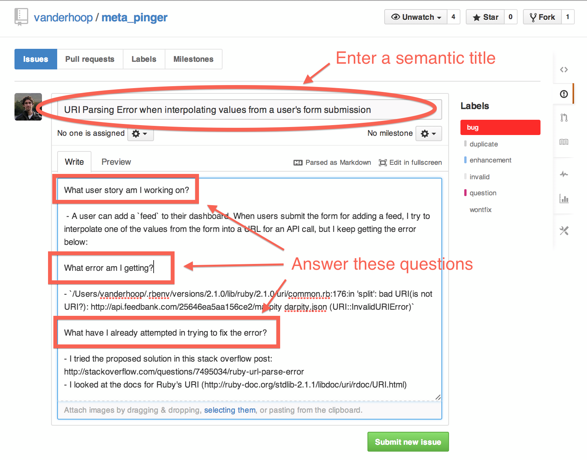

# How to ask a question as a coder

### The Magic Words

The Magic Words are the minimum necessary information to allow people to help 
you with your problem. By including them in your issue / request for help, 
you effectively onboard the developer community (in this case, your instructors)
to your application.

1. What User Story (or feature) are you working on?
1. What error are you getting?
1. How have you attempted to fix your error?

### Describe the problem

- Always begin with **the magic words**.
- Include enough information that it's possible to *reproduce the error*.
- Include links to any research you've done to tackle the issue, and any 
  screenshots as necessary.
- *Write your issue in Markdown!*

